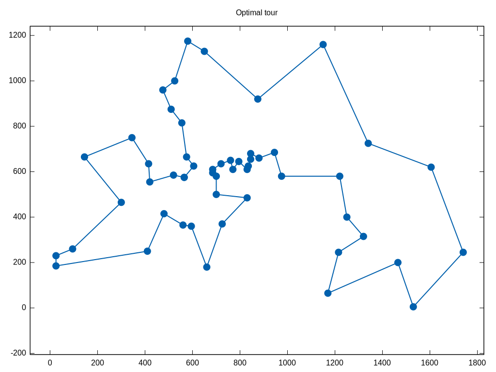

# DTSP repository

The aim of this repository is to unify the process of testing DTPS algorithms. The repository instance file contains data of the original TSP problem instance (from TSPLIB) and 10 changes (subproblems). Besides the data itself, data file contain the optimal value. The "visualization" folder contains tour visualization in SVG format and highlighted edges that were changed. Contact to authors: Łukasz Strąk (lukasz.strak@us.edu.pl), Rafał Skinderowicz (rafal.skinderowicz@us.edu.pl).

## Selected Features
  - based on well-known TSPLIB instances,
  - TSPLIB format with additional headers,
  - contain 10 changes with the optimal value,
  - the optimal tour visualization.

## List of problems

| Problem | Based on instance |
| ------ | ------ |
|berlin52_20140627133219|berlin52|
|berlin52_20140627133558|berlin52|
|berlin52_20140627134102|berlin52|
|berlin52_20140627134445|berlin52|
|berlin52_20140627143757|berlin52|
|berlin52_20140627144325|berlin52|
|berlin52_20140627145554|berlin52|
|berlin52_20140627145839|berlin52|
|berlin52_20140901061129|berlin52|
|ch130_20140618091731|ch130|
|ch130_20140630194224|ch130|
|ch130_20140630194919|ch130|
|ch130_20140630195235|ch130|
|ch130_20140630201151|ch130|
|ch130_20140630201422|ch130|
|ch130_20140630201829|ch130|
|ch130_20140630202530|ch130|
|ch130_20140630203942|ch130|
|gil262_20140618093321|gil262|
|gil262_20140902180649|gil262|
|gil262_20140902203556|gil262|
|gil262_20140902204035|gil262|
|gil262_20140902204448|gil262|
|gil262_20140902204745|gil262|
|gil262_20140902205048|gil262|
|gil262_20140902205444|gil262|
|gil262_20140902205944|gil262|
|gr202_20140618092353|gr202|
|gr202_20140707075748|gr202|
|gr202_20140707083140|gr202|
|gr202_20140707083450|gr202|
|gr202_20140707084651|gr202|
|gr202_20140707085251|gr202|
|gr202_20140707085950|gr202|
|gr202_20140707090432|gr202|
|gr202_20140707090925|gr202|
|gr666_20140618094346|gr666|
|gr666_20140707091712|gr666|
|gr666_20140707093539|gr666|
|gr666_20140707094515|gr666|
|gr666_20140707130100|gr666|
|gr666_20140707132719|gr666|
|kroA100_20140618090845|kroA100|
|kroA100_20140630185623|kroA100|
|kroA100_20140630190004|kroA100|
|kroA100_20140630190324|kroA100|
|kroA100_20140630190633|kroA100|
|kroA100_20140630190959|kroA100|
|kroA100_20140630191625|kroA100|
|kroA100_20140630192410|kroA100|
|kroA100_20140630193925|kroA100|
|kroA200_20140618092106|kroA200|
|kroA200_20140701174914|kroA200|
|kroA200_20140701175822|kroA200|
|kroA200_20140701180429|kroA200|
|kroA200_20140701180710|kroA200|
|kroA200_20140701181029|kroA200|
|kroA200_20140701181823|kroA200|
|kroA200_20140701182847|kroA200|
|kroA200_20140701183654|kroA200|
|pcb442_20140618093746|pcb442|
|pcb442_20140629205908|pcb442|
|pcb442_20140629210534|pcb442|
|pcb442_20140629211625|pcb442|
|pcb442_20140629212515|pcb442|
|pcb442_20140707062614|pcb442|
|pcb442_20140707064709|pcb442|
|pcb442_20140707065838|pcb442|
|pcb442_20140707071156|pcb442|

## File format

The data file with problem instance contains additional headers:
- ITERATION - the subproblem number,
- ITERATIONS - count of all subproblems in the file,
- OPTIMUM - the optimal tour length,
- OPTIMUM_TOUR - the optimal tour in node notation,
- LOCATIONS_CHANGED - % value of nodes that changed in every subproblem, start from the first (the original one),
- CHANGE_COEFFICIENT - when node coordination is randomly changed the new value is calculated based on (1-CHANGE_COEFFICIENT) of the actual position and CHANGE_COEFFICIENT of randomized value,
- CREATION DATE - generated date (should be the same as in file name).

## GitHub repository folder structure

- [out] raw problems instances files,
- [plot] the optimal tour visualization of the DTSP problem instance.

## Example

An example of DTSP problem instance with 5% nodes coordinates changes:

